# Travya - AI-Powered Travel Companion

[](https://opensource.org/licenses/MIT)
[](https://fastapi.tiangolo.com)
[](https://reactjs.org)
[](https://www.typescriptlang.org)

> **Travya** is an intelligent travel planning and booking platform powered by AI agents. Plan trips, discover destinations, book flights, and manage your travel experiences with ease.

## 🌟 Overview

Travya combines the power of AI agents with modern web technologies to provide a comprehensive travel planning experience. The platform features multi-agent AI systems for intelligent trip planning, real-time booking capabilities, and a beautiful, intuitive interface.

### Key Features

- 🤖 **AI-Powered Trip Planning** - Multi-agent system for intelligent itinerary generation
- 🗺️ **Real-Time Mapping** - Interactive maps with location parsing and visualization
- 📸 **Photo Gallery** - Automated photo collection from web scraping
- 💬 **AI Chat Assistant** - Conversational interface for travel queries
- 📝 **Travel Notes** - Sticky-note style notes for trip reminders
- 🔐 **Secure Authentication** - JWT-based auth with user management
- 📊 **Dashboard** - Overview of trips, conversations, and travel statistics
- 🎨 **Modern UI** - Apple-inspired design with dark mode support

## 🏗️ Architecture

Travya follows a microservices architecture with clear separation of concerns:

```mermaid
flowchart TD
    %% FRONTEND
    subgraph F["Frontend (React)"]
        F1["• TanStack Router for routing"]
        F2["• TanStack Query for data fetching"]
        F3["• Chakra UI for components"]
    end

    %% BACKEND
    subgraph B["Backend (FastAPI)"]
        subgraph B1["AI Agents"]
            B1a["• Research"]
            B1b["• Planner"]
            B1c["• Booker"]
        end

        subgraph B2["API Routes"]
            B2a["• Travel"]
            B2b["• Chat"]
            B2c["• Users"]
        end

        subgraph B3["Services"]
            B3a["• RAG"]
            B3b["• Documents"]
            B3c["• Images"]
        end
    end

    %% DATABASES
    subgraph DB1["PostgreSQL"]
        DB1a["• User Data"]
        DB1b["• Trips"]
        DB1c["• Conversations"]
    end

    subgraph DB2["Redis"]
        DB2a["• Sessions"]
        DB2b["• Cache"]
        DB2c["• Memory"]
    end

    %% CONNECTIONS
    F --> B
    B --> DB1
    B --> DB2
```




## 🚀 Quick Start

### Prerequisites

- **Docker Desktop** (recommended for quick setup)
- **Node.js** 18+ and **Python** 3.11+ (for local development)
- **Git**

### Installation & Running

```bash
# 1. Clone the repository
git clone <repository-url>
cd travya

# 2. Set up environment variables
cp backend/env.example .env
# Edit .env with your configuration (API keys, secrets, etc.)

# 3. Start all services
docker compose up -d --build

# 4. Verify services are running
docker compose ps

# 5. Access the application
# Frontend:  http://localhost:5173
# Backend API: http://localhost:8000
# API Docs: http://localhost:8000/docs
# Database Admin: http://localhost:8080
```

The application will be accessible at:
- **Frontend**: http://localhost:5173
- **Backend API**: http://localhost:8000
- **Interactive API Docs**: http://localhost:8000/docs
- **Alternative API Docs**: http://localhost:8000/redoc

## 📁 Project Structure

```
travya/
├── backend/                    # FastAPI backend application
│   ├── app/
│   │   ├── agents/            # AI agent system
│   │   │   ├── base_agent.py          # Base agent class
│   │   │   ├── orchestrator.py       # Agent coordinator
│   │   │   ├── research.py           # Research agent
│   │   │   ├── planner.py            # Planning agent
│   │   │   ├── booker.py              # Booking agent
│   │   │   ├── rag_system.py         # RAG implementation
│   │   │   └── tools.py              # Agent tools
│   │   ├── api/               # API endpoints
│   │   │   ├── routes/        # Route handlers
│   │   │   │   ├── ai_travel.py      # AI travel planning
│   │   │   │   ├── conversations.py  # Chat endpoints
│   │   │   │   ├── travel.py          # Trip management
│   │   │   │   ├── map_parser.py      # Map parsing
│   │   │   │   └── photo_gallery.py   # Photo management
│   │   │   └── main.py        # API router setup
│   │   ├── core/              # Core configuration
│   │   │   ├── config.py       # Settings management
│   │   │   ├── db.py           # Database connection
│   │   │   ├── llm.py          # LLM integration
│   │   │   └── security.py     # Auth utilities
│   │   ├── services/          # Business logic
│   │   │   ├── vector_rag.py           # Vector database
│   │   │   ├── redis_cache.py          # Caching layer
│   │   │   ├── document_storage.py     # File storage
│   │   │   ├── image_scraping.py       # Image collection
│   │   │   ├── itinerary_parser.py     # Itinerary parsing
│   │   │   ├── photo_gallery.py        # Gallery management
│   │   │   └── map_parser.py           # Map processing
│   │   ├── alembic/           # Database migrations
│   │   ├── models.py          # SQLModel definitions
│   │   └── crud.py            # CRUD operations
│   ├── Dockerfile
│   ├── pyproject.toml
│   └── requirements.txt
│
├── frontend/                   # React frontend application
│   ├── src/
│   │   ├── components/        # React components
│   │   │   ├── Common/        # Shared components
│   │   │   │   ├── Navbar.tsx         # Top navigation
│   │   │   │   ├── Sidebar.tsx        # Side navigation
│   │   │   │   └── SidebarItems.tsx   # Menu items
│   │   │   ├── Items/          # Travel Notes
│   │   │   │   ├── AddItem.tsx        # Create note
│   │   │   │   ├── EditItem.tsx       # Edit note
│   │   │   │   └── DeleteItem.tsx     # Delete note
│   │   │   ├── MapParserComponent.tsx # Map visualization
│   │   │   ├── PhotoGallery.tsx       # Photo display
│   │   │   └── Typewriter.tsx        # Typing effect
│   │   ├── routes/            # Application routes
│   │   │   ├── _layout.tsx           # Main layout
│   │   │   ├── _layout/index.tsx     # Dashboard
│   │   │   ├── _layout/chat.tsx      # AI Chat
│   │   │   ├── _layout/plan-trip.tsx # Trip planning
│   │   │   ├── _layout/trips.tsx     # Trip list
│   │   │   ├── _layout/settings.tsx  # User settings
│   │   │   └── _layout/items.tsx     # Travel Notes
│   │   ├── contexts/          # React contexts
│   │   │   ├── AuthContext.tsx       # Auth state
│   │   │   ├── TravelContext.tsx     # Travel data
│   │   │   └── SidebarContext.tsx    # UI state
│   │   ├── hooks/             # Custom hooks
│   │   ├── client/            # Generated API client
│   │   └── main.tsx           # App entry point
│   ├── public/
│   │   └── assets/
│   │       └── images/       # Static assets (logos)
│   ├── Dockerfile
│   └── package.json
│
├── docs/                       # Documentation
│   ├── ai-agents/             # AI agents documentation
│   ├── backend-api/           # Backend API docs
│   ├── frontend/              # Frontend docs
│   ├── database/              # Database schema
│   ├── deployment/            # Deployment guides
│   └── external-apis/         # API integrations
│
├── scripts/                    # Build and deployment scripts
├── docker-compose.yml          # Docker Compose configuration
├── .env                        # Environment variables (gitignored)
└── README.md                   # This file
```

## 🎯 Core Features & Implementation

### 1. AI-Powered Trip Planning

**How it works:**

1. **User creates a trip** via `/plan-trip` page
2. **Request flows**: Frontend → `POST /api/v1/travel/plan` → AI Travel Router
3. **Orchestrator agent** receives the request and delegates to specialized agents:
   - **Research Agent**: Queries knowledge base and external APIs (Google Places)
   - **Planner Agent**: Generates structured itinerary using LLM
   - **Booker Agent**: Handles booking operations (Flights, Hotels)
4. **Response returned**: Complete trip plan with itineraries, bookings, and recommendations

**Code Flow:**
```
frontend/src/routes/_layout/plan-trip.tsx
  → API call: /api/v1/travel/plan
    → backend/app/api/routes/ai_travel.py
      → Agent orchestration: backend/app/agents/orchestrator.py
        → Research: backend/app/agents/research.py
        → Planning: backend/app/agents/planner.py
        → Booking: backend/app/agents/booker.py
```

### 2. Interactive AI Chat

**How it works:**

1. **User sends message** via chat interface
2. **Message stored** in conversation context
3. **AI processes query** and provides travel recommendations
4. **Context maintained** across conversation history
5. **Real-time updates** with streaming responses

**Code Flow:**
```
frontend/src/routes/_layout/chat.tsx
  → API call: /api/v1/conversations/send
    → backend/app/api/routes/conversations.py
      → LLM processing: backend/app/core/llm.py
      → Context retrieval: backend/app/services/vector_rag.py
      → Response streaming back to frontend
```

### 3. Travel Notes (Sticky Notes)

**How it works:**

1. **User creates a note** on `/items` page
2. **Note stored** in PostgreSQL database
3. **Visual display** with colorful sticky-note design
4. **Edit/Delete** actions with confirmation modals
5. **Notes can contain** travel reminders, checklists, ideas

**Code Flow:**
```
frontend/src/routes/_layout/items.tsx
  → API call: /api/v1/items/
    → backend/app/api/routes/items.py
      → CRUD operations: backend/app/crud.py
      → Database: backend/app/models.py (Item model)
```

### 4. Map Parsing & Visualization

**How it works:**

1. **User uploads image** with travel map/locations
2. **Image processed** via OCR and computer vision
3. **Locations extracted** and geocoded
4. **Interactive map displayed** with markers
5. **Clickable markers** show location details

**Code Flow:**
```
frontend/src/components/MapParserComponent.tsx
  → Upload image
    → backend/app/api/routes/map_parser.py
      → OCR processing: backend/app/services/map_parser.py
      → Geocoding: External API (Google Maps)
      → Data returned for visualization
```

### 5. Photo Gallery

**How it works:**

1. **Travellers share photos** from their trips
2. **Auto-collected** via web scraping service
3. **Organized by trip** and location
4. **Displayed in gallery** with captions
5. **Search and filter** capabilities

**Code Flow:**
```
frontend/src/components/PhotoGallery.tsx
  → API call: /api/v1/photo-gallery/
    → backend/app/api/routes/photo_gallery.py
      → Image collection: backend/app/services/image_scraping.py
      → Display in UI
```

## 🛠️ Development Guide

### Local Development Setup

#### Backend Development

```bash
# Navigate to backend
cd backend

# Install dependencies using uv (recommended)
uv sync
source .venv/bin/activate

# Or using pip
pip install -r requirements.txt

# Set up environment
cp env.example .env
# Edit .env with your API keys

# Run database migrations
alembic upgrade head

# Start development server
fastapi run app/main.py --reload
```

#### Frontend Development

```bash
# Navigate to frontend
cd frontend

# Install dependencies
npm install

# Start development server
npm run dev

# Frontend will be available at http://localhost:5173
```

### Database Migrations

```bash
# Create a new migration
docker compose exec backend alembic revision --autogenerate -m "Your description"

# Apply migrations
docker compose exec backend alembic upgrade head

# View migration history
docker compose exec backend alembic history
```

### Running Tests

```bash
# Backend tests
docker compose exec backend pytest
docker compose exec backend pytest tests/agents/
docker compose exec backend pytest tests/api/

# Frontend tests
cd frontend
npm test

# E2E tests
npx playwright test
npx playwright test --ui  # Interactive mode
```

## 🔧 Configuration

### Environment Variables

**Backend (.env)**
```bash
# Application
PROJECT_NAME="Travya"
ENVIRONMENT=local
SECRET_KEY="your-secret-key-here"

# Database
POSTGRES_SERVER=db
POSTGRES_PORT=5432
POSTGRES_USER=travya
POSTGRES_PASSWORD=travya_password
POSTGRES_DB=travya

# Redis
REDIS_URL=redis://redis:6379/0

# AI & External APIs
OPENAI_API_KEY="sk-your-openai-key"
GOOGLE_AI_API_KEY="your-google-key"
GOOGLE_MAPS_API_KEY="your-maps-key"
AMADEUS_API_KEY="your-amadeus-key"
AMADEUS_API_SECRET="your-amadeus-secret"

# Email
SMTP_HOST=smtp.gmail.com
SMTP_PORT=587
SMTP_USER=your-email@gmail.com
SMTP_PASSWORD=your-app-password
EMAILS_FROM_EMAIL=noreply@travya.com

# Security
ACCESS_TOKEN_EXPIRE_MINUTES=11520
CORS_ORIGINS=["http://localhost:5173"]
```

**Frontend (frontend/.env)**
```bash
VITE_API_URL=http://localhost:8000
```

### API Keys Setup

1. **OpenAI**: Get API key from https://platform.openai.com
2. **Google AI**: Get API key from https://makersuite.google.com
3. **Google Maps**: Get API key from https://console.cloud.google.com
4. **Amadeus**: Get API credentials from https://developers.amadeus.com

## 📚 API Documentation

### Interactive Documentation

Once the backend is running, access:
- **Swagger UI**: http://localhost:8000/docs
- **ReDoc**: http://localhost:8000/redoc

### Key Endpoints

**Authentication**
- `POST /api/v1/login/access-token` - Login
- `POST /api/v1/login/register` - Register
- `GET /api/v1/users/me` - Get current user

**Travel Planning**
- `POST /api/v1/travel/plan` - Create trip plan
- `GET /api/v1/travel/trips` - List user trips
- `GET /api/v1/travel/trips/{trip_id}` - Get trip details

**AI Chat**
- `POST /api/v1/conversations/send` - Send message
- `GET /api/v1/conversations` - Get conversations

**Travel Notes**
- `GET /api/v1/items` - List notes
- `POST /api/v1/items` - Create note
- `PUT /api/v1/items/{id}` - Update note
- `DELETE /api/v1/items/{id}` - Delete note

## 🧪 Testing

### Backend Testing

```bash
# Run all tests
docker compose exec backend pytest

# Run with coverage
docker compose exec backend pytest --cov=app --cov-report=html

# Run specific test file
docker compose exec backend pytest tests/agents/test_orchestrator.py

# Run with verbose output
docker compose exec backend pytest -v
```

### Frontend Testing

```bash
# Unit tests
cd frontend
npm test

# E2E tests
npx playwright test

# E2E tests in UI mode
npx playwright test --ui

# Run specific test
npx playwright test login.spec.ts
```

## 🚀 Deployment

### Production Deployment

```bash
# 1. Set production environment
export ENVIRONMENT=production

# 2. Build images
docker compose -f docker-compose.prod.yml build

# 3. Start services
docker compose -f docker-compose.prod.yml up -d

# 4. Check status
docker compose -f docker-compose.prod.yml ps
```

### Using Traefik for HTTPS

```bash
# Start with Traefik
docker compose -f docker-compose.traefik.yml up -d
```

## 📊 Monitoring & Health Checks

```bash
# Health check endpoints
curl http://localhost:8000/api/v1/health

# View logs
docker compose logs -f backend
docker compose logs -f frontend

# View specific service logs
docker compose logs -f redis
docker compose logs -f db
```

## 🤝 Contributing

1. **Fork the repository**
2. **Create feature branch**: `git checkout -b feature/amazing-feature`
3. **Make your changes**
4. **Run tests**: `pytest && npm test`
5. **Commit changes**: `git commit -m 'Add amazing feature'`
6. **Push to branch**: `git push origin feature/amazing-feature`
7. **Open Pull Request**

### Code Style

**Backend** (Python)
```bash
black .
isort .
flake8 .
```

**Frontend** (TypeScript/React)
```bash
npm run lint
npm run format
```

## 📄 License

This project is licensed under the MIT License - see the [LICENSE](LICENSE) file for details.

## 🆘 Support

- **Documentation**: Check the [docs](docs/) directory
- **Issues**: Create an issue on GitHub
- **API Docs**: http://localhost:8000/docs (when running)

## 🙏 Acknowledgments

- FastAPI for the excellent backend framework
- TanStack for Router and Query
- Chakra UI for the component library
- The open-source community
