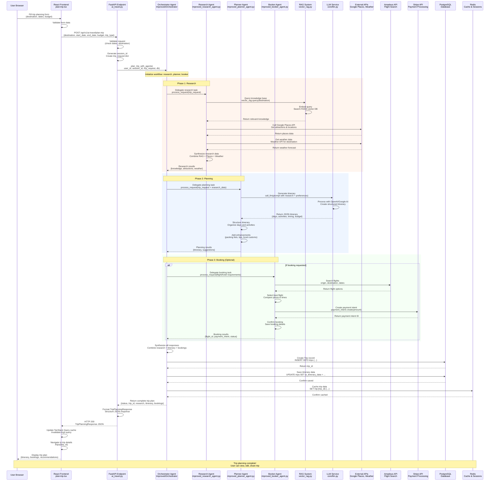
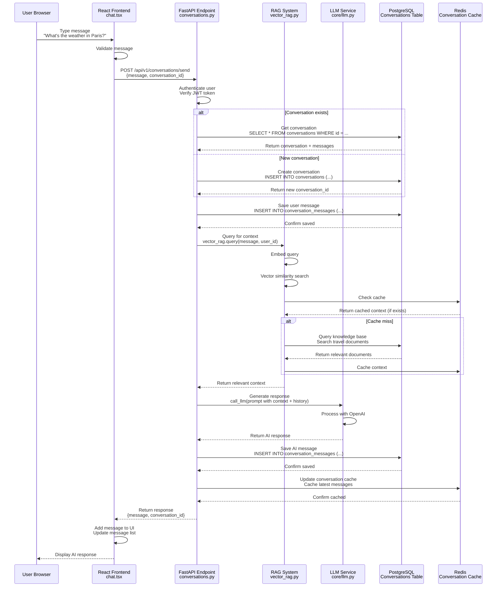
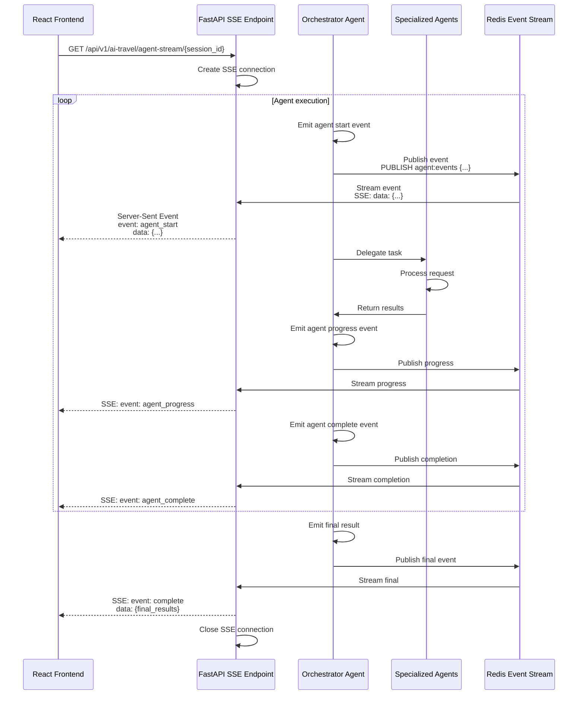
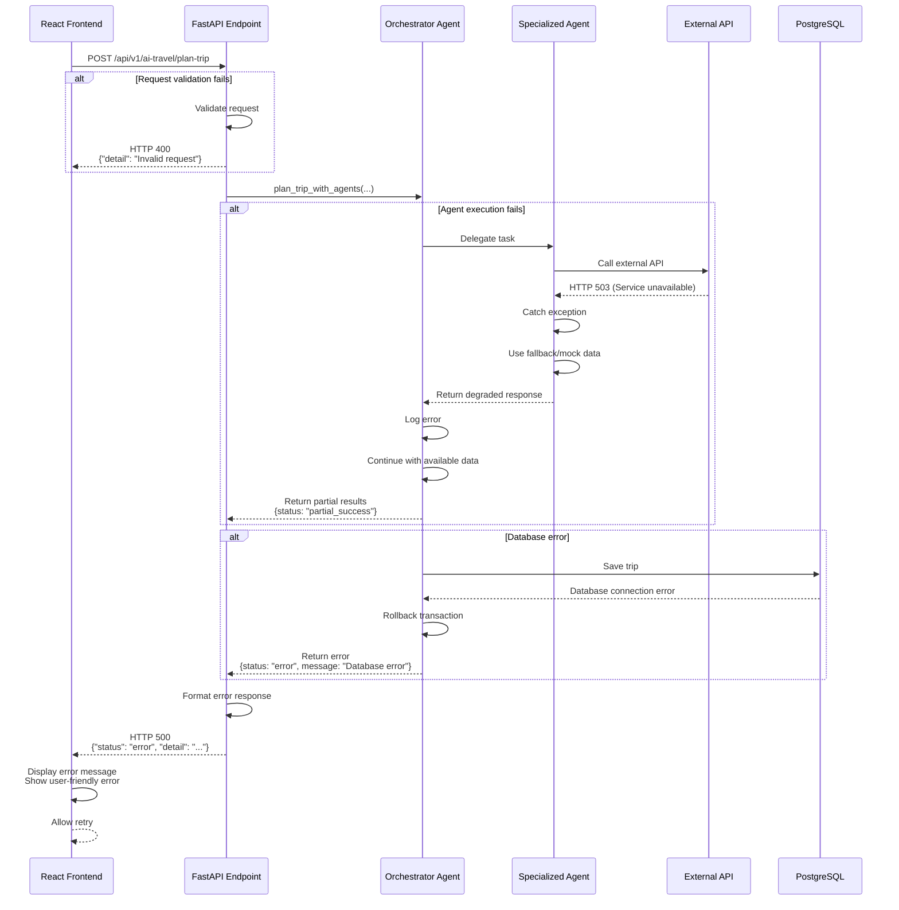

## Sequence Diagram: Travya Trip Planning Flow

### Complete Trip Planning Request Flow

```mermaid
sequenceDiagram
    participant User as User Browser
    participant Frontend as React Frontend<br/>plan-trip.tsx
    participant API as FastAPI Endpoint<br/>ai_travel.py
    participant Orch as Orchestrator Agent<br/>ImprovedOrchestrator
    participant Research as Research Agent<br/>improved_research_agent.py
    participant Planner as Planner Agent<br/>improved_planner_agent.py
    participant Booker as Booker Agent<br/>improved_booker_agent.py
    participant RAG as RAG System<br/>vector_rag.py
    participant LLM as LLM Service<br/>core/llm.py
    participant ExtAPI as External APIs<br/>Google Places, Weather
    participant Amadeus as Amadeus API<br/>Flight Search
    participant Stripe as Stripe API<br/>Payment Processing
    participant PostgreSQL as PostgreSQL<br/>Database
    participant Redis as Redis<br/>Cache & Sessions

    User->>Frontend: Fill trip planning form<br/>(destination, dates, budget)
    Frontend->>Frontend: Validate form data
    
    Frontend->>API: POST /api/v1/ai-travel/plan-trip<br/>{destination, start_date, end_date, budget, trip_type}
    
    API->>API: Validate request<br/>(check dates, destination)
    API->>API: Generate session_id<br/>Create trip_request dict
    
    API->>Orch: plan_trip_with_agents(<br/>user_id, session_id, trip_request, db)
    
    Note over Orch: Initialize workflow: research, planner, booker
    
    rect rgb(255, 245, 238)
        Note over Orch,Research: Phase 1: Research
        Orch->>Research: Delegate research task<br/>process_request(trip_request)
        
        Research->>RAG: Query knowledge base<br/>vector_rag.query(destination)
        RAG->>RAG: Embed query<br/>Search FAISS vector DB
        RAG-->>Research: Return relevant knowledge
        
        Research->>ExtAPI: Call Google Places API<br/>Get attractions & locations
        ExtAPI-->>Research: Return places data
        
        Research->>ExtAPI: Get weather data<br/>Weather API for destination
        ExtAPI-->>Research: Return weather forecast
        
        Research->>Research: Synthesize research data<br/>Combine RAG + Places + Weather
        Research-->>Orch: Research results<br/>{knowledge, attractions, weather}
    end
    
    rect rgb(238, 245, 255)
        Note over Orch,Planner: Phase 2: Planning
        Orch->>Planner: Delegate planning task<br/>process_request(trip_request + research_data)
        
        Planner->>LLM: Generate itinerary<br/>call_llm(prompt with research + preferences)
        LLM->>LLM: Process with OpenAI/Google AI<br/>Create structured itinerary
        LLM-->>Planner: Return JSON itinerary<br/>{days, activities, timing, budget}
        
        Planner->>Planner: Structure itinerary<br/>Organize days and activities
        Planner->>Planner: Add enhancements<br/>(packing lists, tips, local customs)
        Planner-->>Orch: Planning results<br/>{itinerary, suggestions}
    end
    
    rect rgb(245, 255, 245)
        Note over Orch,Booker: Phase 3: Booking (Optional)
        alt If booking requested
            Orch->>Booker: Delegate booking task<br/>process_request(flight/hotel requirements)
            
            Booker->>Amadeus: Search flights<br/>origin, destination, dates
            Amadeus-->>Booker: Return flight options
            
            Booker->>Booker: Select best flight<br/>Compare prices & times
            
            Booker->>Stripe: Create payment intent<br/>payment_intent.create(amount)
            Stripe-->>Booker: Return payment intent ID
            
            Booker->>Booker: Confirm booking<br/>Save booking details
            Booker-->>Orch: Booking results<br/>{flight_id, payment_intent, status}
        end
    end
    
    Orch->>Orch: Synthesize all responses<br/>Combine research + itinerary + bookings
    
    Orch->>PostgreSQL: Create Trip record<br/>INSERT INTO trips (...)
    PostgreSQL-->>Orch: Return trip_id
    
    Orch->>PostgreSQL: Save itinerary data<br/>UPDATE trips SET ai_itinerary_data = ...
    PostgreSQL-->>Orch: Confirm saved
    
    Orch->>Redis: Cache trip data<br/>SET trip:{trip_id} {...}
    Redis-->>Orch: Confirm cached
    
    Orch-->>API: Return complete trip plan<br/>{status, trip_id, research, itinerary, bookings}
    
    API->>API: Format TripPlanningResponse<br/>Structure JSON response
    
    API-->>Frontend: HTTP 200<br/>TripPlanningResponse JSON
    
    Frontend->>Frontend: Update TanStack Query cache<br/>Invalidate trips query
    Frontend->>Frontend: Navigate to trip details<br/>/trips/{trip_id}
    Frontend-->>User: Display trip plan<br/>(itinerary, bookings, recommendations)
    
    Note over User,Redis: Trip planning complete!<br/>User can view, edit, share trip
```

## AI Chat Flow Sequence

```mermaid
sequenceDiagram
    participant User as User Browser
    participant Frontend as React Frontend<br/>chat.tsx
    participant API as FastAPI Endpoint<br/>conversations.py
    participant RAG as RAG System<br/>vector_rag.py
    participant LLM as LLM Service<br/>core/llm.py
    participant PostgreSQL as PostgreSQL<br/>Conversations Table
    participant Redis as Redis<br/>Conversation Cache

    User->>Frontend: Type message<br/>"What's the weather in Paris?"
    Frontend->>Frontend: Validate message
    
    Frontend->>API: POST /api/v1/conversations/send<br/>{message, conversation_id}
    
    API->>API: Authenticate user<br/>Verify JWT token
    
    alt Conversation exists
        API->>PostgreSQL: Get conversation<br/>SELECT * FROM conversations WHERE id = ...
        PostgreSQL-->>API: Return conversation + messages
    else New conversation
        API->>PostgreSQL: Create conversation<br/>INSERT INTO conversations (...)
        PostgreSQL-->>API: Return new conversation_id
    end
    
    API->>PostgreSQL: Save user message<br/>INSERT INTO conversation_messages (...)
    PostgreSQL-->>API: Confirm saved
    
    API->>RAG: Query for context<br/>vector_rag.query(message, user_id)
    RAG->>RAG: Embed query
    RAG->>RAG: Vector similarity search
    RAG->>Redis: Check cache
    Redis-->>RAG: Return cached context (if exists)
    
    alt Cache miss
        RAG->>PostgreSQL: Query knowledge base<br/>Search travel documents
        PostgreSQL-->>RAG: Return relevant documents
        RAG->>Redis: Cache context
    end
    
    RAG-->>API: Return relevant context
    
    API->>LLM: Generate response<br/>call_llm(prompt with context + history)
    LLM->>LLM: Process with OpenAI
    LLM-->>API: Return AI response
    
    API->>PostgreSQL: Save AI message<br/>INSERT INTO conversation_messages (...)
    PostgreSQL-->>API: Confirm saved
    
    API->>Redis: Update conversation cache<br/>Cache latest messages
    Redis-->>API: Confirm cached
    
    API-->>Frontend: Return response<br/>{message, conversation_id}
    
    Frontend->>Frontend: Add message to UI<br/>Update message list
    Frontend-->>User: Display AI response
```

## Real-Time Agent Events Flow

```mermaid
sequenceDiagram
    participant Frontend as React Frontend
    participant API as FastAPI SSE Endpoint
    participant Orchestrator as Orchestrator Agent
    participant Agents as Specialized Agents
    participant Redis as Redis Event Stream

    Frontend->>API: GET /api/v1/ai-travel/agent-stream/{session_id}
    API->>API: Create SSE connection
    
    loop Agent execution
        Orchestrator->>Orchestrator: Emit agent start event
        Orchestrator->>Redis: Publish event<br/>PUBLISH agent:events {...}
        
        Redis->>API: Stream event<br/>SSE: data: {...}
        API-->>Frontend: Server-Sent Event<br/>event: agent_start<br/>data: {...}
        
        Orchestrator->>Agents: Delegate task
        Agents->>Agents: Process request
        
        Agents->>Orchestrator: Return results
        Orchestrator->>Orchestrator: Emit agent progress event
        Orchestrator->>Redis: Publish progress
        Redis->>API: Stream progress
        API-->>Frontend: SSE: event: agent_progress
        
        Orchestrator->>Orchestrator: Emit agent complete event
        Orchestrator->>Redis: Publish completion
        Redis->>API: Stream completion
        API-->>Frontend: SSE: event: agent_complete
    end
    
    Orchestrator->>Orchestrator: Emit final result
    Orchestrator->>Redis: Publish final event
    Redis->>API: Stream final
    API-->>Frontend: SSE: event: complete<br/>data: {final_results}
    
    API->>API: Close SSE connection
```

## Error Handling Flow

```mermaid
sequenceDiagram
    participant Frontend as React Frontend
    participant API as FastAPI Endpoint
    participant Orchestrator as Orchestrator Agent
    participant Agent as Specialized Agent
    participant External as External API

    Frontend->>API: POST /api/v1/ai-travel/plan-trip
    
    alt Request validation fails
        API->>API: Validate request
        API-->>Frontend: HTTP 400<br/>{"detail": "Invalid request"}
    end
    
    API->>Orchestrator: plan_trip_with_agents(...)
    
    alt Agent execution fails
        Orchestrator->>Agent: Delegate task
        Agent->>External: Call external API
        External-->>Agent: HTTP 503 (Service unavailable)
        
        Agent->>Agent: Catch exception
        Agent->>Agent: Use fallback/mock data
        Agent-->>Orchestrator: Return degraded response
        
        Orchestrator->>Orchestrator: Log error
        Orchestrator->>Orchestrator: Continue with available data
        Orchestrator-->>API: Return partial results<br/>{status: "partial_success"}
    end
    
    alt Database error
        Orchestrator->>PostgreSQL: Save trip
        PostgreSQL-->>Orchestrator: Database connection error
        Orchestrator->>Orchestrator: Rollback transaction
        Orchestrator-->>API: Return error<br/>{status: "error", message: "Database error"}
    end
    
    API->>API: Format error response
    API-->>Frontend: HTTP 500<br/>{"status": "error", "detail": "..."}
    
    Frontend->>Frontend: Display error message<br/>Show user-friendly error
    Frontend-->>Frontend: Allow retry
```
